ECE 5745 Tutorial 5: Synopsys/Cadence ASIC Tools
==========================================================================

 - Author: Christopher Batten
 - Date: January 26, 2019

**Table of Contents**

 - Introduction
 - Nangate 45nm Standard-Cell Library
 - PyMTL3-Based Testing, Simulation, Translation
 - Using Synopsys Design Compiler for Synthesis
 - Using Cadence Innovus for Place-and-Route
 - Using Synopsys PrimeTime for Power Analysis
 - Using Verilog RTL Models
 - To Do On Your Own

Introduction
--------------------------------------------------------------------------

This tutorial will discuss the various views that make-up a standard-cell
library and then illustrate how to use a set of Synopsys and Cadence ASIC
tools to map an RTL design down to these standard cells and ultimately
silicon. The tutorial will discuss the key tools used for synthesis,
place-and-route, and power analysis. This tutorial requires entering
commands manually for each of the tools to enable students to gain a
better understanding of the detailed steps involved in this process. The
next tutorial will illustrate how this process can be automated to
facilitate rapid design-space exploration. This tutorial assumes you have
already completed the tutorials on Linux, Git, PyMTL3, and Verilog.

The following diagram illustrates the four primary tools we will be using
in ECE 5745 along with a few smaller secondary tools. Notice that the
ASIC tools all require various views from the standard-cell library.


 1. We use the PyMTL3 framework to test, verify, and evaluate the
    execution time (in cycles) of our design. This part of the flow is
    very similar to the flow used in ECE 4750. Note that we can write our
    RTL models in either PyMTL3 or Verilog, but we will always use PyMTL3
    for the test harnesses, simulation drivers, and high-level modeling.
    Once we are sure our design is working correctly, we can then start
    to push the design through the flow. The ASIC flow requires Verilog
    RTL as an input, so we can use PyMTL3's automatic translation tool to
    translate PyMTL3 RTL models into Verilog RTL. We also generate
    waveforms in `.vcd` (Verilog Change Dump) format, and we use
    `vcd2saif` to convert these waveforms into per-net average activity
    factors stored in `.saif` format. These activity factors will be used
    for power analysis.

 2. We use Synopsys Design Compiler (DC) to synthesize our design, which
    means to transform the Verilog RTL model into a Verilog gate-level
    netlist where all of the gates are selected from the standard-cell
    library. We need to provide Synopsys DC with abstract logical and
    timing views of the standard-cell library in `.db` format. We also
    provide provide Synopsys DC with the `.saif` file to enable mapping
    high-level RTL net names into low-level gate-level net names, and this
    mapping is stored in a `.namemap` file. This name mapping will be
    used for power analysis. In addition to the Verilog gate-level
    netlist, Synopsys DC can also generate a `.ddc` file which contains
    information about the gate-level netlist and timing, and this `.ddc`
    file can be inspected using Synopsys Design Vision (DV).

 3. We use Cadence Innovus to place-and-route our design, which means to
    place all of the gates in the gate-level netlist into rows on the
    chip and then to generate the metal wires that connect all of the
    gates together. We need to provide Cadence Innovus with the same
    abstract logical and timing views used in Synopsys DC, but we also
    need to provide Cadence Innovus with technology information in
    `.lef`, and `.captable` format and abstract physical views of the
    standard-cell library also in `.lef` format. Cadence Innovus will
    generate an updated Verilog gate-level netlist, a `.spef` file which
    contains parasitic resistance/capacitance information about all nets
    in the design, and a `.gds` file which contains the final layout. The
    `.gds` file can be inspected using the open-source Klayout GDS
    viewer. Cadence Innovus also generates reports which can be used to
    accurately characterize area and timing.

 4. We use Synopsys PrimeTime (PT) to perform power analysis of our
    design. We need to provide Synopsys PT with the same abstract
    logical, timing, and power views used in Synopsys DC and Cadence
    Innovus, but in addition we need to provide switching activity
    information for every net in the design (which comes from the `.saif`
    file), capacitance information for every net in the design (which
    comes from the `.spef` file), and a file which maps high-level RTL
    names to low-level gate-level names (which comes from the `.namemap`
    file). Synopsys PT puts the switching activity, capacitance, clock
    frequency, and voltage together to estimate the power consumption of
    every net and thus every module in the design, and these estimates
    are captured in various reports.

Extensive documentation is provided by Synopsys and Cadence for these
ASIC tools. We have organized this documentation and made it available to
you on the [public course
webpage](http://www.csl.cornell.edu/courses/ece5745/syndocs). The
username/password was distributed during lecture.

The first step is to source the setup script, clone this repository from
GitHub, and define an environment variable to keep track of the top
directory for the project.

    % source setup-ece5745.sh
    % mkdir $HOME/ece5745
    % cd $HOME/ece5745
    % git clone git@github.com:cornell-ece5745/ece5745-tut5-asic-tools
    % cd ece5745-tut5-asic-tools
    % TOPDIR=$PWD

Nangate 45nm Standard-Cell Library
--------------------------------------------------------------------------

Before you can gain access to a standard-cell library, you need to gain
access to a "physical design kit" (PDK). A PDK includes all of the design
files required for full-custom circuit design for a specific technology.
So this will include a design-rule manual as well as SPICE circuit models
for transistors and other devices. Gaining access to a real PDK is
difficult. It requires negotiating with the foundry and signing multiple
non-disclosure agreements. So in this course we will be using the
FreePDK45 PDK:

 - https://www.eda.ncsu.edu/wiki/FreePDK45:Contents

This is an open PDK for a "fake" technology. It was created by
universities using publically available data on several different
commercial 45nm processes. This means you cannot actually tapeout a chip
using this PDK, but the technology is representative enough to provide
reasonable area, energy, and timing estimates for research and teaching
purposes. You can find the FreePDK45 PDK installed here:

    % cd $ADK_PKGS/freepdk-45nm/pkgs/FreePDK45-1.4

A standard-cell designer will use the PDK to implement the standard-cell
library. A standard-cell library is a collection of combinational and
sequential logic gates that adhere to a standardized set of logical,
electrical, and physical policies. For example, all standard cells are
usually the same height, include pins that align to a predetermined
vertical and horizontal grid, include power/ground rails and nwells in
predetermined locations, and support a predetermined number of drive
strengths. A standard-cell designer will usually create a high-level
behavioral specification (in Verilog), circuit schematics (in SPICE), and
the actual layout (in `.gds` format) for each logic gate. The Synopsys
and Cadence tools do not actually use these low-level implementations,
since they are actually _too_ detailed. Instead these tools use _abstract
views_ of the standard cells, which capture logical functionality,
timing, geometry, and power usage at a much higher level.

Just like with a PDK, gaining access to a real standard-cell library is
difficult. It requires gaining access to the PDK first, negotiating with
a company which makes standard cells, and usually signing more
non-disclosure agreements. In this course, we will be using the Nangate
45nm standard-cell library which is based on the open FreePDK45 PDK.

 - http://projects.si2.org/openeda.si2.org/projects/nangatelib

Nangate is a company which makes a tool to automatically generate
standard-cell libraries, so they have made this library publically
available a way to demonstrate their tool. Since it is an open library it
is a great resource for research and teaching. Even though the
standard-cell library is based on a "fake" 45nm PDK, the library provides
a very reasonable estimate of a real commercial standard library in a
real 45nm technology. In this section, we will take a look at both the
low-level implementations and high-level views of the Nangate
standard-cell library.

A standard-cell library distribution can contain gigabytes of data in
thousands of files. For example, here is the distribution for the Nangate
standard-cell library.

```
 % cd $ADK_PKGS/freepdk-45nm/pkgs/NangateOpenCellLibrary_PDKv1_3_v2010_12
```

To simplify using the Nangate standard-cell library in this course, we
have created a much smaller set of well-defined symlinks which point to
just the key files we want to use in this course. We call this collection
of symlinks an "ASIC design kit" (ADK). Here is the directory which
contains these symlinks.

```
 % cd $ECE5745_STDCELLS
 % ls
 pdk-models.sp          # spice models for transistors

 rtk-stream-out.map     # gds layer map
 rtk-tech.lef           # interconnect technology information
 rtk-tech.tf            # interconnect technology information
 rtk-typical.captable   # interconnect technology information

 stdcells.spi           # circuit schematics for each cell
 stdcells.gds           # layout for each cell
 stdcells.v             # behavioral specification for each cell

 stdcells-lpe.spi       # circuit schematics with parasitics for each cell
 stdcells.lib           # abstract logical, timing, power view for each cell (typical)
 stdcells-bc.lib        # best case .lib
 stdcells-wc.lib        # worst case .lib
 stdcells.lef           # abstract physical view for each cell

 stdcells.db            # binary compiled version of .lib file
 stdcells.mwlib         # Milkyway database built from .lef file

 stdcells-databook.pdf  # standard-cell library databook

 klayout.lyp            # layer settings for Klayout
 adk.tcl                # general TCL settings for the ADK
```

Let's begin by looking at the schematic for a 3-input NAND cell
(NAND3_X1).

```
 % less -p NAND3_X1 $ECE5745_STDCELLS/stdcells.spi
 .SUBCKT NAND3_X1 A1 A2 A3 ZN VDD VSS
 *.PININFO A1:I A2:I A3:I ZN:O VDD:P VSS:G
 *.EQN ZN=!((A1 * A2) * A3)
 M_i_2 net_1 A3 VSS   VSS NMOS_VTL W=0.415000U L=0.050000U
 M_i_1 net_0 A2 net_1 VSS NMOS_VTL W=0.415000U L=0.050000U
 M_i_0 ZN    A1 net_0 VSS NMOS_VTL W=0.415000U L=0.050000U
 M_i_5 ZN    A3 VDD   VDD PMOS_VTL W=0.630000U L=0.050000U
 M_i_4 VDD   A2 ZN    VDD PMOS_VTL W=0.630000U L=0.050000U
 M_i_3 ZN    A1 VDD   VDD PMOS_VTL W=0.630000U L=0.050000U
 .ENDS
```

For students with a circuits background, there should be no surprises
here, and for those students with less circuits background we will cover
basic static CMOS gate design later in the course. Essentially, this
schematic includes three NMOS transistors arranged in series in the
pull-down network, and three PMOS transistors arranged in parallel in the
pull-up network. The PMOS transistors are larger than the NMOS
transistors (see `W=` parameter) because the mobility of holes is less
than the mobility of electrons.

Now let's look at the layout for the 3-input NAND cell using the
open-source Klayout GDS viewer.

```
 % klayout -l $ECE5745_STDCELLS/klayout.lyp $ECE5745_STDCELLS/stdcells.gds
```

Note that we are using the `.lyp` file which is a predefined layer color
scheme that makes it easier to view GDS files. To view the 3-input NAND
cell, find the NAND3_X1 cell in the left-hand cell list, and then choose
_Display > Show as New Top_ from the menu. Here is a picture of the
layout for this cell.

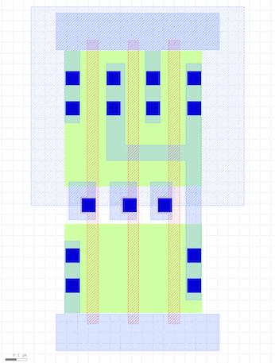

Diffusion is green, polysilicon is red, contacts are solid dark blue,
metal 1 (M1) is blue, and the nwell is the large gray rectangle over the
top half of the cell. All standard cells will be the same height and have
the nwell in the same place. Notice the three NMOS transistors arranged
in series in the pull-down network, and three PMOS transistors arranged
in parallel in the pull-up network. The power rail is the horizontal
strip of M1 at the top, and the ground rail is the horizontal strip of M1
at the bottom. All standard cells will have the power and ground rails in
the same place so they will connect via abutment if these cells are
arranged in a row. Although it is difficult to see, the three input pins
and one output pin are labeled squares of M1, and these pins are arranged
to be on a predetermined grid.

Now let's look at the Verilog behavioral specification for the 3-input
NAND cell.

```
 % less -p NAND3_X1 $ECE5745_STDCELLS/stdcells.v
 module NAND3_X1 (A1, A2, A3, ZN);
   input A1;
   input A2;
   input A3;
   output ZN;

   not(ZN, i_8);
   and(i_8, i_9, A3);
   and(i_9, A1, A2);

   specify
     (A1 => ZN) = (0.1, 0.1);
     (A2 => ZN) = (0.1, 0.1);
     (A3 => ZN) = (0.1, 0.1);
   endspecify

 endmodule
```

Note that the Verilog implementation of the 3-input NAND cell looks
nothing like the Verilog we used in ECE 4750. This cell is implemented
using Verilog primitive gates (e.g., `not`, `and`) and it includes a
`specify` block which is used for advanced gate-level simulation with
back-annotated delays.

We can use sophisticated tools to extract detailed parasitic resistance
and capacitance values from the layout, and then we can add these
parasitics to the circuit schematic to create a much more accurate model
for experimenting with the circuit timing and power. Let's look at a
snippet of the extracted circuit for the 3-input NAND cell:

```
 % less -p NAND3_X1 $ECE5745_STDCELLS/stdcells-lpe.spi
 .SUBCKT NAND3_X1 VDD VSS A3 ZN A2 A1
 *.PININFO VDD:P VSS:G A3:I ZN:O A2:I A1:I
 *.EQN ZN=!((A1 * A2) * A3)
 M_M3 N_ZN_M0_d  N_A3_M0_g N_VDD_M0_s VDD PMOS_VTL W=0.630000U L=0.050000U
 M_M4 N_VDD_M1_d N_A2_M1_g N_ZN_M0_d  VDD PMOS_VTL W=0.630000U L=0.050000U
 M_M5 N_ZN_M2_d  N_A1_M2_g N_VDD_M1_d VDD PMOS_VTL W=0.630000U L=0.050000U
 M_M0 net_1      N_A3_M3_g N_VSS_M3_s VSS NMOS_VTL W=0.415000U L=0.050000U
 M_M1 net_0      N_A2_M4_g net_1      VSS NMOS_VTL W=0.415000U L=0.050000U
 M_M2 N_ZN_M5_d  N_A1_M5_g net_0      VSS NMOS_VTL W=0.415000U L=0.050000U
 C_x_PM_NAND3_X1%VDD_c0 x_PM_NAND3_X1%VDD_39 VSS 3.704e-17
 C_x_PM_NAND3_X1%VDD_c1 x_PM_NAND3_X1%VDD_36 VSS 2.74884e-18
 C_x_PM_NAND3_X1%VDD_c2 x_PM_NAND3_X1%VDD_26 VSS 2.61603e-16
 C_x_PM_NAND3_X1%VDD_c3 N_VDD_M1_d           VSS 6.57971e-17
 C_x_PM_NAND3_X1%VDD_c4 x_PM_NAND3_X1%VDD_19 VSS 1.89932e-17
 C_x_PM_NAND3_X1%VDD_c5 x_PM_NAND3_X1%VDD_18 VSS 3.74888e-17
 C_x_PM_NAND3_X1%VDD_c6 N_VDD_M0_s           VSS 3.64134e-17
 ...
 .ENDS
```

The full model is a couple of hundred lines long, so you can see how
detailed this model is! The ASIC tools do not really need this much
detail. We can use a special set of tools to create a much higher level
abstract view of the timing and power of this circuit suitable for use by
the ASIC tools. Essentially, these tools run many, many circuit-level
simulations to create characterization data stored in a `.lib` (Liberty)
file. Let's look at snippet of the `.lib` file for the 3-input NAND cell.

```
 % less -p NAND3_X1 $ECE5745_STDCELLS/stdcells.lib
 cell (NAND3_X1) {
  drive_strength          : 1;
  area                    : 1.064000;
  cell_leakage_power      : 18.104768;
  leakage_power () {
    when                  : "!A1 & !A2 & !A3";
    value                 : 3.318854;
  }
  ...
  pin (A1) {
    direction             : input;
    related_power_pin     : "VDD";
    related_ground_pin    : "VSS";
    capacitance           : 1.590286;
    fall_capacitance      : 1.562033;
    rise_capacitance      : 1.590286;
  }
  ...
  pin (ZN) {
    direction             : output;
    related_power_pin     : "VDD";
    related_ground_pin    : "VSS";
    max_capacitance       : 58.364900;
    function              : "!((A1 & A2) & A3)";

    timing () {

      related_pin         : "A1";
      timing_sense        : negative_unate;

      cell_fall(Timing_7_7) {
        index_1 ("0.00117378,0.00472397,0.0171859,0.0409838,0.0780596,0.130081,0.198535");
        index_2 ("0.365616,1.823900,3.647810,7.295610,14.591200,29.182500,58.364900");
        values ("0.0106270,0.0150189,0.0204521,0.0312612,0.0528211,0.0959019,0.182032", \
                "0.0116171,0.0160692,0.0215549,0.0324213,0.0540285,0.0971429,0.183289", \
                "0.0157475,0.0207077,0.0261030,0.0369216,0.0585239,0.101654,0.187820", \
                "0.0193780,0.0263217,0.0337702,0.0462819,0.0677259,0.110616,0.196655", \
                "0.0218025,0.0305247,0.0399593,0.0560603,0.0822203,0.125293,0.210827", \
                "0.0229784,0.0334449,0.0447189,0.0640615,0.0959700,0.146382,0.231434", \
                "0.0227986,0.0349768,0.0480836,0.0705081,0.107693,0.167283,0.259623");
      }
      ...

      internal_power () {
        related_pin       : "A1";
        fall_power(Power_7_7) {
          index_1 ("0.00117378,0.00472397,0.0171859,0.0409838,0.0780596,0.130081,0.198535");
          index_2 ("0.365616,1.823900,3.647810,7.295610,14.591200,29.182500,58.364900");
          values ("0.523620,0.538965,0.551079,0.556548,0.561151,0.564018,0.564418", \
                  "0.459570,0.484698,0.509668,0.529672,0.543887,0.554682,0.559331", \
                  "0.434385,0.457202,0.470452,0.498312,0.517651,0.538469,0.550091", \
                  "0.728991,0.630651,0.581024,0.559124,0.551408,0.553714,0.557387", \
                  "1.306597,1.153240,1.010684,0.831268,0.727155,0.657699,0.616287", \
                  "2.170611,1.965158,1.760932,1.459438,1.140559,0.930355,0.781393", \
                  "3.276307,3.084566,2.831754,2.426623,1.913607,1.439055,1.113950");
        }
        ...
      }
  ...
 }
```

This is just a small subset of the information included in the `.lib`
file for this cell. We will talk more about the details of such `.lib`
files later in the course, but you can see that the `.lib` file contains
information about area, leakage power, capacitance of each input pin,
logical functionality, and timing. Units for all data is provided at the
top of the `.lib` file. In this snippet you can see that the area of the
cell is 1.064 square micron and the leakage power is 18.1nW. The
capacitance for the input pin `A1` is 1.59fF, although there is
additional data that captures how the capacitance changes depending on
whether the input is rising or falling. The output pin `ZN` implements
the logic equation `!((A1 & A2) & A3)` (i.e., a three-input NAND gate).
Data within the `.lib` file is often represented using one- or
two-dimensional lookup tables (i.e., a `values` table). You can see two
such tables in the above snippet.

Let's start by focusing on the first table. This table captures the delay
from input pin `A1` to output pin `ZN` as a function of two parameters:
the input transition time (horizontal direction in lookup table) and the
load capacitance (vertical direction in lookup table). Note that this
delay is when `ZN` is "falling" (i.e., when it is transitioning from high
to low). There is another table for the delay when `ZN` is rising, and
there are additional tables for every input. Gates are slower when the
inputs take longer to transition and/or when they are driving large
output loads. Each entry in the lookup table reflects characterization of
one or more detailed circuit-level simulations. So in this example the
delay from input pin `A1` to output pin `ZN` is 16ps when the input
transition rate is 4.7ps and the output load is 1.82fF. This level of
detail can enable very accurate static timing analysis of our designs.

Let's now focus on the second table. This table captures the internal
power, which is the power consumed within the gate itself, again as a
function of two paramers: the input transition time (horizontal direction
in lookup table) and the load capacitance (vertical direction in lookup
table). Each entry in the lookup table is calculated by measuring the
current drawn from the power supply during a detailed SPICE simulation
and _subtracting_ any current used to charge the output load. In other
words all of the energy that is _not_ consumed charging up the output
load is considered internal energy. Note that sometimes the internal
power is negative. This is simply due to how we account for energy. We
can either assume all energy is consumed only when the output node is
charged and no energy is consumed when the output node is discharged,
_or_ we can assume half the energy is consumed when the output is node is
charged and half the energy is consumed when the output node is
discharged in which case you will sometimes see negative internal power.

Note that some of the ASIC tools actually do not use the `.lib` file
directly, but instead use a pre-compiled binary version of the `.lib`
file stored in `.db` format. The binary `.db` file is usually much more
compact that the text `.lib` file. The `.lib` file captures the abstract
logical, timing, and power aspects of the standard-cell library, but it
does not capture the physical aspects of the standard-cell library. While
the ASIC tools could potentially use the `.gds` file directly, the ASIC
tools do not really need this much detail. We can use a special set of
tools to create a much higher level abstract view of the physical aspects
of the cell suitable for use by the ASIC tools. These tools create `.lef`
files. Let's look at snippet of the the `.lef` file for the 3-input NAND
cell.

```
 % less -p NAND3_X1 $ECE5745_STDCELLS/stdcells.lef
MACRO NAND3_X1
  CLASS core ;
  FOREIGN NAND3_X1 0.0 0.0 ;
  ORIGIN 0 0 ;
  SYMMETRY X Y ;
  SITE FreePDK45_38x28_10R_NP_162NW_34O ;
  SIZE 0.76 BY 1.4 ;

  PIN A1
    DIRECTION INPUT ;
    ANTENNAPARTIALMETALAREA 0.0175 LAYER metal1 ;
    ANTENNAPARTIALMETALSIDEAREA 0.0715 LAYER metal1 ;
    ANTENNAGATEAREA 0.05225 ;
    PORT
      LAYER metal1 ;
        POLYGON 0.44 0.525 0.54 0.525 0.54 0.7 0.44 0.7  ;
    END
  END A1

  PIN ZN
    DIRECTION OUTPUT ;
    ANTENNAPARTIALMETALAREA 0.1352 LAYER metal1 ;
    ANTENNAPARTIALMETALSIDEAREA 0.4992 LAYER metal1 ;
    ANTENNADIFFAREA 0.197925 ;
    PORT
      LAYER metal1 ;
        POLYGON 0.235 0.8 0.605 0.8 0.605 0.15 0.675 0.15
         0.675 1.25 0.605 1.25 0.605 0.87 0.32 0.87 0.32 1.25 0.235 1.25  ;
    END
  END ZN

  PIN VDD
    DIRECTION INOUT ;
    USE power ;
    SHAPE ABUTMENT ;
    PORT
      LAYER metal1 ;
        POLYGON 0 1.315 0.04 1.315 0.04 0.975 0.11 0.975 0.11 1.315
         0.415 1.315 0.415 0.975 0.485 0.975 0.485 1.315 0.76 1.315 0.76 1.485 0 1.485  ;
    END
  END VDD

  ...
END NAND3_X1
```

This is just a small subset of the information included in the `.lef`
file for this cell. You can see the `.lef` file includes information on
the dimensions of the cell and the location and dimensions of both
power/ground and signal pins. The file also includes information on
"obstructions" (or blockages) indicated with a `OBS` entry. Take a look
at the NAND4_X4 gate to see an obstruction. These are regions of the cell
which should not be used by the ASIC tools. For example, if a cell needs
to use metal 2 (M2), it would create a blockage on M2 so that the ASIC
tools know now to route any M2 wires in that area. You can use Klayout to
view `.lef` files as well.

```
 % klayout
```

Choose _File > Import > LEF_ from the menu. Navigate to the
`stdcells.lef` file. Here is a picture of the `.lef` for this cell.

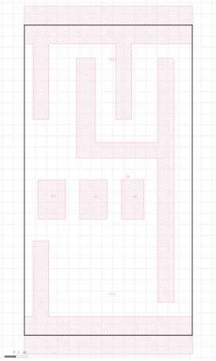

If you compare the `.lef` to the `.gds` you can see that the `.lef` is a
much simpler representation that only captures the boundary, pins, and
obstructions.

The standard-cell library also includes several files (e.g.,
`rtk-tech.tf`, `rtk-tech.lef`, `rtk-typical.captable`) that capture
information about the metal interconnect including the wire width, pitch,
and parasitics. For example, let's take a look at the `.captable` file:

```
 % less -p M1 $ECE5745_STDCELLS/rtk-typical.captable
 LAYER M1
   MinWidth              0.07000
   MinSpace              0.06500
#  Height                0.37000
   Thickness             0.13000
   TopWidth              0.07000
   BottomWidth           0.07000
   WidthDev              0.00000
   Resistance            0.38000
 END
 ...
 M1
 width(um)  space(um) Ctot(Ff/um)  Cc(Ff/um)    Carea(Ff/um) Cfrg(Ff/um)
 0.070       0.052       0.1986       0.0723       0.0311       0.0115
 0.070       0.065       0.1705       0.0509       0.0311       0.0143
 0.070       0.200       0.1179       0.0115       0.0311       0.0319
 0.070       0.335       0.1150       0.0030       0.0311       0.0388
 0.070       0.470       0.1148       0.0009       0.0311       0.0409
 0.070       0.605       0.1147       0.0002       0.0311       0.0416
 0.070       0.740       0.1147       0.0001       0.0311       0.0417
```

This file contains information about the minimum dimenisions of wires on
M1 and the resistance of these wires. It also contains a table of wire
capacitances with different rows for different wire widths and spacings.
The ASIC tools can use this kind of technology information to optimize
and analyze the design.

Finally, a standard-cell library will always include a databook, which is
a document that describes the details of every cell in the library. Take
a few minutes to browse through the Nangate standard-cell library
databook located here:

 - http://www.csl.cornell.edu/courses/ece5745/resources/freepdk45-nangate-databook.pdf

PyMTL3-Based Testing, Simulation, Translation
--------------------------------------------------------------------------

Our goal in this tutorial is to generate layout for the sort unit from
the PyMTL3 tutorial using the ASIC tools. As a reminder, the sort unit
takes as input four integers and a valid bit and outputs those same four
integers in increasing order with the valid bit. The sort unit is
implemented using a three-stage pipelined, bitonic sorting network and
the datapath is shown below.


Let's start by running the tests for the sort unit and note that the
tests for the `SortUnitStructRTL` will fail.

```
 % mkdir $TOPDIR/sim/build
 % cd $TOPDIR/sim/build
 % py.test ../tut3_pymtl/sort
 % py.test ../tut3_pymtl/sort --test-verilog
```

You can just copy over your implementation of the `MinMaxUnit` from when
you completed the PyMTL3 tutorial. If you have not completed the PyMTL3
tutorial then you might want to go back and do that now. Basically the
`MinMaxUnit` should look like this:

```
from pymtl3 import *
from pymtl3 import *

class MinMaxUnit( Component ):

  # Constructor

  def construct( s, DataType ):

    s.in0     = InPort ( DataType )
    s.in1     = InPort ( DataType )
    s.out_min = OutPort( DataType )
    s.out_max = OutPort( DataType )

    @s.update
    def block():

      if s.in0 >= s.in1:
        s.out_max = s.in0
        s.out_min = s.in1
      else:
        s.out_max = s.in1
        s.out_min = s.in0

  # Line tracing

  def line_trace( s ):
    return f"{s.in0}|{s.in1}(){s.out_min}|{s.out_max}"
```

The `--test-verilog` command line option tells the PyMTL3 framework to
first translate the sort unit into Verilog, and then important it back
into PyMTL3 to verify that the translated Verilog is itself correct. With
the `--test-verilog` command line option, PyMTL3 will skip tests that are
not for verifying RTL. After running the tests we use the sort unit
simulator to do the final translation into Verilog and to dump the `.vcd`
(Value Change Dump) file that we want to use for power analysis.

```
 % cd $TOPDIR/sim/build
 % ../tut3_pymtl/sort/sort-sim --impl rtl-struct --stats --translate --dump-vcd
 num_cycles          = 105
 num_cycles_per_sort = 1.05
```

Take a moment to open up the translated Verilog which should be in a file
named `SortUnitStructRTL_8bit.v`. Try to see how both the structural
composition and the behavioral modeling translates into Verilog. Here is
an example of the translation for the `MinMaxUnit`. Notice how PyMTL3 will
output the source Python embedded as a comment in the corresponding
translated Verilog.

```
 % cd $TOPDIR/sim/build
 % less SortUnitStructRTL_8bit.v

 // PyMTL3 Component MinMaxUnit Definition
 // At .../sim/tut3_pymtl/sort/MinMaxUnit.py
 module MinMaxUnit__DataType_Bits8
 (
   input  logic [0:0] clk,
   input  logic [7:0] in0,
   input  logic [7:0] in1,
   output logic [7:0] out_max,
   output logic [7:0] out_min,
   input  logic [0:0] reset
 );

   // PyMTL3 Update Block Source
   // At .../sim/tut3_pymtl/sort/MinMaxUnit.py:26
   // @s.update
   // def block():
   //
   //   if s.in0 >= s.in1:
   //     s.out_max = s.in0
   //     s.out_min = s.in1
   //   else:
   //     s.out_max = s.in1
   //     s.out_min = s.in0

   always_comb begin : block
     if ( in0 >= in1 ) begin
       out_max = in0;
       out_min = in1;
     end
     else begin
       out_max = in1;
       out_min = in0;
     end
   end

 endmodule
```

The Verilog module name includes a suffix to make it unique for a
specific set of parameters. Although we hope students will not need to
actually open up this translated Verilog it is occasionally necessary.
For example, PyMTL3 is not perfect and can translate incorrectly which
might require looking at the Verilog to see where it went wrong. Other
steps in the ASIC flow might refer to an error in the translated Verilog
which will also require looking at the Verilog to figure out why the
other steps are going wrong. While we try and make things as automated as
possible, students will eventually need to dig in and debug some of these
steps themselves.

The `.vcd` file contains information about the state of every net in the
design on every cycle. This can make these `.vcd` files very large and
thus slow to analyze. For average power analysis, we only need to know
the activity factor on each net. We can use the `vcd2saif` tool to
convert `.vcd` files into `.saif` files. An `.saif` file only contains a
single average activity factor for every net.

```
 % cd $TOPDIR/sim/build
 % vcd2saif -input sort-rtl-struct-random.vcd -output sort-rtl-struct-random.saif
```

Using Synopsys Design Compiler for Synthesis
--------------------------------------------------------------------------

We use Synopsys Design Compiler (DC) to synthesize Verilog RTL models
into a gate-level netlist where all of the gates are from the standard
cell library. So Synopsys DC will synthesize the Verilog `+` operator
into a specific arithmetic block at the gate-level. Based on various
constraints it may synthesize a ripple-carry adder, a carry-look-ahead
adder, or even more advanced parallel-prefix adders.

We start by creating a subdirectory for our work, and then launching
Synopsys DC.

```
 % mkdir -p $TOPDIR/asic-manual/synopsys-dc
 % cd $TOPDIR/asic-manual/synopsys-dc
 % dc_shell-xg-t
```

To make it easier to copy-and-paste commands from this document, we tell
Synopsys DC to ignore the prefix `dc_shell>` using the following:

```
 dc_shell> alias "dc_shell>" ""
```

There are two important variables we need to set before starting to work
in Synopsys DC. The `target_library` variable specifies the standard
cells that Synopsys DC should use when synthesizing the RTL. The
`link_library` variable should search the standard cells, but can also
search other cells (e.g., SRAMs) when trying to resolve references in our
design. These other cells are not meant to be available for Synopsys DC
to use during synthesis, but should be used when resolving references.
Including `*` in the `link_library` variable indicates that Synopsys DC
should also search all cells inside the design itself when resolving
references.

```
 dc_shell> set_app_var target_library "$env(ECE5745_STDCELLS)/stdcells.db"
 dc_shell> set_app_var link_library   "* $env(ECE5745_STDCELLS)/stdcells.db"
```

Note that we can use `$env(ECE5745_STDCELLS)` to get access to the
`$ECE5745_STDCELLS` environment variable which specifies the directory
containing the standard cells, and that we are referencing the abstract
logical and timing views in the `.db` format.

The next step is to turn on name mapping. When we do power analysis we
will be using activity factors from RTL simulation in `.saif` format with
gate-level models. There will be many nets from the RTL simulation that
may not exist in the gate-level model, but ideally there will still be
enough nets that are present in both the `.saif` file and the gate-level
model to be able to do reasonably accurate power estimation. To help this
process, name mapping will keep track of how names in the RTL map to
names in the gate-level model.

```
 dc_shell> saif_map -start
```

As an aside, if you want to learn more about any command in any Synopsys
tool, you can simply type `man toolname` at the shell prompt. We are now
ready to read in the Verilog file which contains the top-level design and
all referenced modules. We do this with two commands. The `analyze`
command reads the Verilog RTL into an intermediate internal
representation. The `elaborate` command recursively resolves all of the
module references starting from the top-level module, and also infers
various registers and/or advanced data-path components.

```
 dc_shell> analyze -format sverilog ../../sim/build/SortUnitStructRTL_8bit.v
 dc_shell> elaborate SortUnitStructRTL_8bit
```

We can use the `check_design` command to make sure there are no obvious
errors in our Verilog RTL.

```
 dc_shell> check_design
```

You should not see any warnings, however, it is _critical_ that you
carefully review all warnings and errors when you analyze and elaborate a
design with Synopsys DC. There may be many warnings, but you should still
skim through them. Often times there will be something very wrong in your
Verilog RTL which means any results from using the ASIC tools is
completely bogus. Synopsys DC will output a warning, but Synopsys DC will
usually just keep going, potentially producing a completely incorrect
gate-level model!

We need to create a clock constraint to tell Synopsys DC what our target
cycle time is. Synopsys DC will not synthesize a design to run "as fast
as possible". Instead, the designer gives Synopsys DC a target cycle time
and the tool will try to meet this constraint while minimizing area and
power. The `create_clock` command takes the name of the clock signal in
the Verilog (which in this course will always be `clk`), the label to
give this clock (i.e., `ideal_clock1`), and the target clock period in
nanoseconds. So in this example, we are asking Synopsys DC to see if it
can synthesize the design to run at 3GHz (i.e., a cycle time of 300ps).

```
 dc_shell> create_clock clk -name ideal_clock1 -period 0.3
```

Finally, the `compile` command will do the synthesis.

```
 dc_shell> compile
```

During synthesis, Synopsys DC will display information about its
optimization process. It will report on its attempts to map the RTL into
standard-cells, optimize the resulting gate-level netlist to improve the
delay, and then optimize the final design to save area.

The `compile` command does not _flatten_ your design. Flatten means to
remove module hierarchy boundaries; so instead of having module A and
module B within module C, Synopsys DC will take all of the logic in
module A and module B and put it directly in module C. You can enable
flattening with the `-ungroup_all` option. Without extra hierarchy
boundaries, Synopsys DC is able to perform more optimizations and
potentially achieve better area, energy, and timing. However, an
unflattened design is much easier to analyze, since if there is a module
A in your RTL design that same module will always be in the synthesized
gate-level netlist.

The `compile` command does not perform many optimizations. Synopsys DC
also includes `compile_ultra` which does many more optimizations and will
likely produce higher quality of results. Keep in mind that the `compile`
command _will not_ flatten your design by default, while the
`compile_ultra` command _will_ flattened your design by default. You can
turn off flattening by using the `-no_autoungroup` option with the
`compile_ultra` command. Once you finish this tutorial, feel free to go
back and experiment with the `compile_ultra` command.

The next step is to create and then output the `.namemap` file which
contains the name mapping we will use in power analysis.

```
 dc_shell> saif_map -create_map \
  -input "../../sim/build/sort-rtl-struct-random.saif" \
  -source_instance "TOP/SortUnitStructRTL_8bit"

 dc_shell> saif_map -type ptpx -write_map "post-synth.namemap"
```

Now that we have synthesized the design, we output the resulting
gate-level netlist in two different file formats: Verilog and `.ddc`
(which we will use with Synopsys DesignVision).

```
 dc_shell> write -format verilog -hierarchy -output post-synth.v
 dc_shell> write -format ddc     -hierarchy -output post-synth.ddc
```

We can use various commands to generate reports about area, energy, and
timing. The `report_timing` command will show the critical path through
the design. Part of the report is displayed below.

```
 dc_shell> report_timing -nosplit -transition_time -nets -attributes
  ...
  Point                                       Fanout     Trans  Incr  Path
  --------------------------------------------------------------------------
  clock ideal_clock1 (rise edge)                                0.00  0.00
  clock network delay (ideal)                                   0.00  0.00
  elm_S0S1__0/out_reg[5]/CK (DFF_X1)                      0.00  0.00  0.00 r
  elm_S0S1__0/out_reg[5]/Q (DFF_X1)                       0.01  0.09  0.09 r
  elm_S0S1__0/out[5] (net)                      2               0.00  0.09 r
  elm_S0S1__0/out[5] (Reg__Type_Bits8_0)                        0.00  0.09 r
  elm_S0S1__0__out[5] (net)                                     0.00  0.09 r
  minmax0_S1/in0[5] (MinMaxUnit__DataType_Bits8_0)              0.00  0.09 r
  minmax0_S1/in0[5] (net)                                       0.00  0.09 r
  minmax0_S1/U56/ZN (INV_X1)                              0.01  0.03  0.12 f
  minmax0_S1/n64 (net)                          3               0.00  0.12 f
  minmax0_S1/U44/ZN (NAND2_X1)                            0.01  0.03  0.14 r
  minmax0_S1/n43 (net)                          1               0.00  0.14 r
  minmax0_S1/U40/ZN (OAI21_X1)                            0.01  0.03  0.18 f
  minmax0_S1/n44 (net)                          2               0.00  0.18 f
  minmax0_S1/U47/ZN (NOR2_X1)                             0.02  0.04  0.22 r
  minmax0_S1/n45 (net)                          1               0.00  0.22 r
  minmax0_S1/U13/ZN (OAI221_X1)                           0.02  0.05  0.27 f
  minmax0_S1/n10 (net)                          2               0.00  0.27 f
  minmax0_S1/U49/ZN (NAND2_X1)                            0.03  0.06  0.33 r
  minmax0_S1/n59 (net)                          6               0.00  0.33 r
  minmax0_S1/U69/ZN (OAI22_X1)                            0.01  0.04  0.38 f
  minmax0_S1/out_min[3] (net)                   1               0.00  0.38 f
  minmax0_S1/out_min[3] (MinMaxUnit__DataType_Bits8_0)          0.00  0.38 f
  minmax0_S1__out_min[3] (net)                                  0.00  0.38 f
  elm_S1S2__0/in_[3] (Reg__Type_Bits8_8)                        0.00  0.38 f
  elm_S1S2__0/in_[3] (net)                                      0.00  0.38 f
  elm_S1S2__0/out_reg[3]/D (DFF_X1)                       0.01  0.01  0.38 f
  data arrival time                                                   0.38

  clock ideal_clock1 (rise edge)                                0.30  0.30
  clock network delay (ideal)                                   0.00  0.30
  elm_S1S2__0/out_reg[3]/CK (DFF_X1)                            0.00  0.30 r
  library setup time                                           -0.04  0.26
  data required time                                                  0.26
  --------------------------------------------------------------------------
  data required time                                                  0.26
  data arrival time                                                  -0.38
  --------------------------------------------------------------------------
  slack (VIOLATED)                                                   -0.13
```

This timing report uses _static timing analysis_ to find the critical
path. Static timing analysis checks the timing across all paths in the
design (regardless of whether these paths can actually be used in
practice) and finds the longest path. For more information about static
timing analysis, consult Chapter 1 of the [Synopsys Timing Constraints
and Optimization User
Guide](http://www.csl.cornell.edu/courses/ece5745/syndocs/tcoug.pdf). The
report clearly shows that the critical path starts at bit 5 of a pipeline
register in between the S1 and S2 stages (`elm_S0S1__0`), goes into the
first input of a `MinMaxUnit`, comes out the `out_min` port of the
`MinMaxUnit`, and ends at a pipeline register in between the S1 and S2
stages (`elm_S1S2__0`). The report shows the delay through each logic
gate (e.g., the clk-to-q delay of the initial DFF is 90ps, the
propagation delay of a NAND2_X1 gate is 30ps) and the total delay for the
critical path which in this case is 0.38ns. Notice that there are two
NAND2_X1 gates, but they do have the same propagation delay; this is
because the static timing analysis also factors in input slew rates, rise
vs fall time, and output load when calculating the delay of each gate. We
set the clock constraint to be 300ps, but also notice that the report
factors in the setup time required at the final register. The setup time
is 40ps, so in order to operate the sort unit at 1ns and meet the setup
time we would need the critical path to arrive in 260ps.

The difference between the required arrival time and the actual arrival
time is called the _slack_. Positive slack means the path arrived before
it needed to while negative slack means the path arrived after it needed
to. If you end up with negative slack, then you need to rerun the tools
with a longer target clock period until you can meet timing with no
negative slack. The process of tuning a design to ensure it meets timing
is called "timing closure". In this course we are primarily interested in
design-space exploration as opposed to meeting some externally defined
target timing specification. So you will need to sweep a range of target
clock periods. **Your goal is to choose the shortest possible clock
period which still meets timing without any negative slack!** This will
result in a well-optimized design and help identify the "fundamental"
performance of the design. Alternatively, if you are comparing multiple
designs, sometimes the best situation is to tune the baseline so it has a
couple of percent of negative slack and then ensure the alternative
designs have similar cycle times. This will enable a fair comparison
since all designs will be running at the same cycle time.

The `report_area` command can show how much area each module uses and can
enable detailed area breakdown analysis.

```
 dc_shell> report_area -nosplit -hierarchy
 ...
 Combinational area:         339.682001
 Buf/Inv area:                90.440000
 Noncombinational area:      451.401984
 Macro/Black Box area:         0.000000
 Net Interconnect area:       undefined  (Wire load has zero net area)

 Total cell area:            791.083986
 Total area:                  undefined

 Hierarchical area distribution
 ------------------------------

                    Global      Local
                    Cell Area   Cell Area
                    ----------  ----------------
 Hierarchical cell  Abs               Non  Black
                    Total  %    Comb  Comb Boxes
 ----------------- ------ ---- ----- ----- ---  -------------------------------
 SortUnitStructRTL  791.0  100   0.0   0.0 0.0  SortUnitStructRTL_8bit
 elm_S0S1__0         36.1  4.6   0.0  36.1 0.0  Reg__Type_Bits8_0
 elm_S0S1__1         36.1  4.6   0.0  36.1 0.0  Reg__Type_Bits8_11
 elm_S0S1__2         36.1  4.6   0.0  36.1 0.0  Reg__Type_Bits8_10
 elm_S0S1__3         36.1  4.6   0.0  36.1 0.0  Reg__Type_Bits8_9
 elm_S1S2__0         36.1  4.6   0.0  36.1 0.0  Reg__Type_Bits8_8
 elm_S1S2__1         36.1  4.6   0.0  36.1 0.0  Reg__Type_Bits8_7
 elm_S1S2__2         36.1  4.6   0.0  36.1 0.0  Reg__Type_Bits8_6
 elm_S1S2__3         36.1  4.6   0.0  36.1 0.0  Reg__Type_Bits8_5
 elm_S2S3__0         36.7  4.6   0.0  36.7 0.0  Reg__Type_Bits8_4
 elm_S2S3__1         37.2  4.7   0.0  37.2 0.0  Reg__Type_Bits8_3
 elm_S2S3__2         37.7  4.8   0.0  37.7 0.0  Reg__Type_Bits8_2
 elm_S2S3__3         36.7  4.6   0.0  36.7 0.0  Reg__Type_Bits8_1
 minmax0_S1          75.5  9.5  75.5   0.0 0.0  MinMaxUnit__DataType_Bits8_0
 minmax0_S2          72.6  9.2  72.6   0.0 0.0  MinMaxUnit__DataType_Bits8_4
 minmax1_S1          71.2  9.0  71.2   0.0 0.0  MinMaxUnit__DataType_Bits8_3
 minmax1_S2          72.3  9.1  72.3   0.0 0.0  MinMaxUnit__DataType_Bits8_2
 minmax_S3           43.8  5.5  43.8   0.0 0.0  MinMaxUnit__DataType_Bits8_1
 val_S0S1             5.8  0.7   1.3   4.5 0.0  RegRst__Type_Bits1__reset_value_0_0
 val_S1S2             5.8  0.7   1.3   4.5 0.0  RegRst__Type_Bits1__reset_value_0_2
 val_S2S3             5.8  0.7   1.3   4.5 0.0  RegRst__Type_Bits1__reset_value_0_1
 ----------------- ------ ---- ----- ----- ---  -------------------------------
 Total                         339.6 451.4 0.0
```

The units are in square micron. The cell area can sometimes be different
from the total area. The total cell area includes just the standard
cells, while the total area can include interconnect area as well. If
available, we will want to use the total area in our analysis. Otherwise
we can just use the cell area. So we can see that the sort unit consumes
approximately 791um^2 of area. We can also see that each pipeline
register consumes about 4-5% of the area, while the `MinMaxUnit`s consume
about ~40% of the area. This is one reason we try not to flatten our
designs, since the module hierarchy helps us understand the area
breakdowns. If we completely flattened the design there would only be one
line in the above table.

The `report_power` command can show how much power each module consumes.
Note that this power analysis is actually not that useful yet, since at
this stage of the flow the power analysis is based purely on statistical
activity factor estimation. Basically, Synopsys DC assumes every net
toggles 10% of the time. This is a pretty poor estimate, so we should
never use this kind of statistical power estimation in this course.

```
 dc_shell> report_power -nosplit -hierarchy
```

Finally, we go ahead and exit Synopsys DC.

```
 dc_shell> exit
```

Take a few minutes to examine the resulting Verilog gate-level netlist.
Notice that the module hierarchy is preserved and also notice that the
`MinMaxUnit` synthesizes into a large number of basic logic gates.

```
 % cd $TOPDIR/asic-manual/synopsys-dc
 % more post-synth.v
```

We can use the Synopsys Design Vision (DV) tool for browsing the
resulting gate-level netlist, plotting critical path histograms, and
generally analyzing our design. Start Synopsys DV and setup the
`target_library` and `link_library` variables as before.

```
 % cd $TOPDIR/asic-manual/synopsys-dc
 % design_vision-xg
 design_vision> set_app_var target_library "$env(ECE5745_STDCELLS)/stdcells.db"
 design_vision> set_app_var link_library   "* $env(ECE5745_STDCELLS)/stdcells.db"
```

Choose _File > Read_ from the menu to open `post-synth.ddc` file
generated during synthesis. You can then use the following steps to view
the gate-level schematic for the `MinMaxUnit`:

 - Select the `minmax0_S1` module in the _Logical Hierarchy_ panel
 - Choose _Schematic > New Schematic View_ from the menu
 - Double click the box representing the `MinMaxUnit` in the schematic view

This shows you the exact gates used to implement the `MinMaxUnit`. You
can use the following steps to view a histogram of path slack, and also
to open a gave-level schematic of just the critical path.

 - Choose _Timing > Path Slack_ from the menu
 - Click _OK_ in the pop-up window
 - Select the left-most bar in the histogram to see list of most critical paths
 - Right click first path (the critical path) and choose _Path Schematic_

This shows you the exact gates that lie on the critical path. Notice that
there nine levels of logic (including the registers) on the critical
path. The number of levels of logic on the critical path can provide some
very rough first-order intuition on whether or not we might want to
explore a more aggressive clock constraint and/or adding more pipeline
stages. If there are just a few levels of logic on the critical path then
our design is probably very simple (as in this case!), while if there are
more than 50 levels of logic then there is potentially room for
signficant improvement. The following screen capture illutrates using
Design Vision to explore the post-synthesis results. While this can be
interesting, in this course, we almost always prefer exploring the
post-place-and-route results, so we will not really use Synopsys DC that
often.

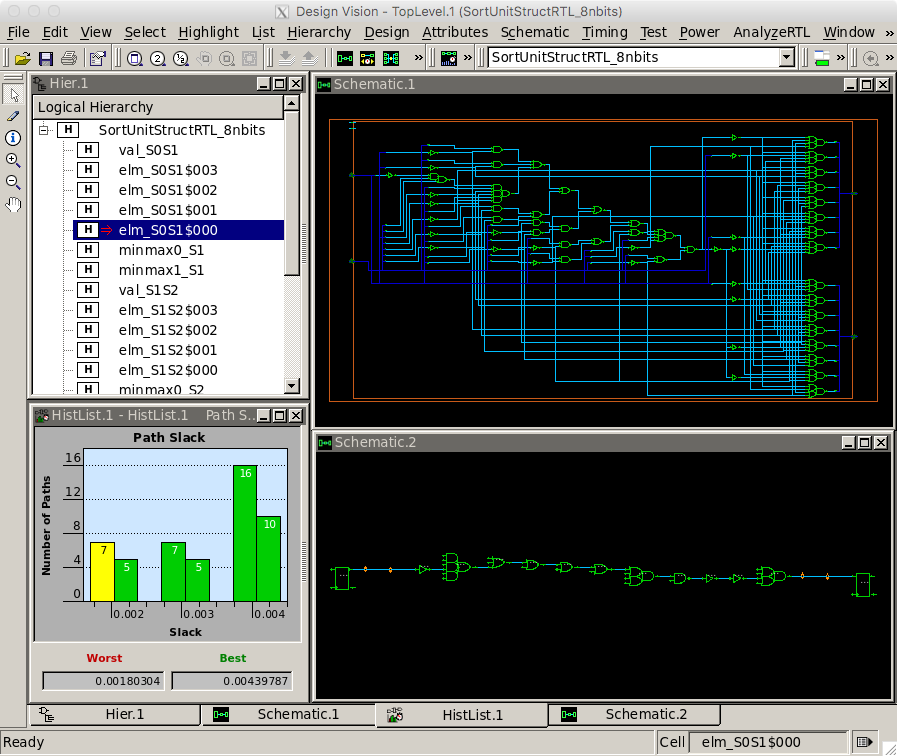

**To Do On Your Own:** Sweep a range of target clock frequencies to
determine the shortest possible clock period which still meets timing
without any negative slack. You can put a sequence of commands in a
`.tcl` file and then run Synopsys DC using those commands in one step
like this:

```
 % cd $TOPDIR/asic-manual/synopsys-dc
 % dc_shell-xg-t -f init.tcl
```

So consider placing the commands from this section into a `.tcl` file
and then running Synopsys DC with a target clock period of 0.3ns. Then
gradually increase the clock period until your design meets timing.

Using Cadence Innovus for Place-and-Route
--------------------------------------------------------------------------

We use Cadence Innovus for placing standard cells in rows and then
automatically routing all of the nets between these standard cells. We
also use Cadence Innovus to route the power and ground rails in a grid
and connect this grid to the power and ground pins of each standard cell,
and to automatically generate a clock tree to distribute the clock to all
sequential state elements with hopefully low skew.

We will be running Cadence Innovus in a separate directory to keep the
files separate from the other tools.

```
 % mkdir -p $TOPDIR/asic-manual/cadence-innovus
 % cd $TOPDIR/asic-manual/cadence-innovus
```

Before starting Cadence Innovus, we need to create two files which will
be loaded into the tool. The first file is a `.sdc` file which contains
timing constraint information about our design. This file is where we
specify our target clock period, but it is also where we could specify
input or output delay constraints (e.g., the output signals must be
stable 200ps before the rising edge). Use Geany or your favorite text
editor to create a file named `constraints.sdc` in
`$TOPDIR/asic-manual/cadence-innovus` with the following content:

```
 create_clock clk -name ideal_clock -period 0.3
```

The create_clock command is similar to the command we used in synthesis,
and we usually use the same target clock period that we used for
synthesis. In this case, we are targeting a 333MHz clock frequency (i.e.,
a 0.3ns clock period). **You should replace the target clock period with
whatever clock period was used to successfully meet timing in the
previous section.**

The second file is a "multi-mode multi-corner" (MMMC) analysis file. This
file specifies what "corner" to use for our timing analysis. A corner is
a characterization of the standard cell library and technology with
specific assumptions about the process, temperature, and voltage (PVT).
So we might have a "fast" corner which assumes best-case process
variability, low temperature, and high voltage, or we might have a "slow"
corner which assumes worst-case variability, high temperature, and low
voltage. To ensure our design will work across a range of operating
conditions, we need to evaluate our design across a range of corners. In
this course, we will keep things simple by only considering a "typical"
corner (i.e., average PVT). Use Geany or your favorite text editor to
create a file named `setup-timing.tcl` in
`$TOPDIR/asic-manual/cadence-innovus` with the following content:

```
 create_rc_corner -name typical \
    -cap_table "$env(ECE5745_STDCELLS)/rtk-typical.captable" \
    -T 25

 create_library_set -name libs_typical \
    -timing [list "$env(ECE5745_STDCELLS)/stdcells.lib"]

 create_delay_corner -name delay_default \
    -early_library_set libs_typical \
    -late_library_set libs_typical \
    -rc_corner typical

 create_constraint_mode -name constraints_default \
    -sdc_files [list constraints.sdc]

 create_analysis_view -name analysis_default \
    -constraint_mode constraints_default \
    -delay_corner delay_default

 set_analysis_view \
    -setup [list analysis_default] \
    -hold [list analysis_default]
```

The `create_rc_corner` command loads in the `.captable` file that we
examined earlier. This file includes information about the resistance and
capacitance of every metal layer. Notice that we are loading in the
"typical" captable and we are specifying an "average" operating
temperature of 25 degC. The `create_library_set` command loads in the
`.lib` file that we examined earlier. This file includes information
about the input/output capacitance of each pin in each standard cell
along with the delay from every input to every output in the standard
cell. The `create_delay_corner` specifies a specific corner that we would
like to use for our timing analysis by putting together a `.captable` and
a `.lib` file. In this specific example, we are creating a typical corner
by putting together the typical `.captable` and typical `.lib` we just
loaded. The `create_constraint_mode` command loads in the `.sdc` file we
mentioned earlier in this section. The `create_analysis_view` command
puts together constraints with a specific corner, and the
`set_analysis_view` command tells Cadence Innovus that we would like to
use this specific analysis view for both setup and hold time analysis.

Now that we have created our `constraints.sdc` and `setup-timing.tcl`
files we can start Cadence Innovus:

```
 % cd $TOPDIR/asic-manual/cadence-innovus
 % innovus -64
```

As we enter commands we will be able use the GUI to see incremental
progress towards a fully placed-and-routed design. We need to set various
variables before starting to work in Cadence Innovus. These variables
tell Cadence Innovus the location of the MMMC file, the location of the
Verilog gate-level netlist, the name of the top-level module in our
design, the location of the `.lef` files, and finally the names of the
power and ground nets.

```
 innovus> set init_mmmc_file "setup-timing.tcl"
 innovus> set init_verilog   "../synopsys-dc/post-synth.v"
 innovus> set init_top_cell  "SortUnitStructRTL_8bit"
 innovus> set init_lef_file  "$env(ECE5745_STDCELLS)/rtk-tech.lef $env(ECE5745_STDCELLS)/stdcells.lef"
 innovus> set init_gnd_net   "VSS"
 innovus> set init_pwr_net   "VDD"
```

We are now ready to use the `init_design` command to read in the verilog,
set the design name, setup the timing analysis views, read the technology
`.lef` for layer information, and read the standard cell `.lef` for
physical information about each cell used in the design.

```
 innovus> init_design
```

The next step is to do some floorplaning. This is where we broadly
organize the chip in terms of its overall dimensions and the placement of
any previously designed blocks. For now we just do some very simple
floorplanning using the `floorPlan` command.

```
 innovus> floorPlan -r 1.0 0.70 4.0 4.0 4.0 4.0
```

In this example, we have chosen the aspect ratio to be 1.0 and a target
cell utilization to be 70%. The cell utilization is the percentage of the
final chip that will actually contain useful standard cells as opposed to
just "filler" cells (i.e., empty cells). Ideally, we would like the cell
utilization to be 100% but this is simply not reasonable. If the cell
utilization is too high, Cadence Innovus will spend way too much time
trying to optimize the design and will eventually simply give up. A
target cell utilization of 70% makes it more likely that Cadence Innovus
can successfuly place and route the design. We have also added 4.0um of
margin around the top, bottom, left, and right of the chip to give us
room for the power ring which will go around the entire chip.

The following screen capture illustrates what you should see: a square
floorplan with rows where the standard cells will eventually be placed.
You can use the _View > Fit_ menu option to see the entire chip.

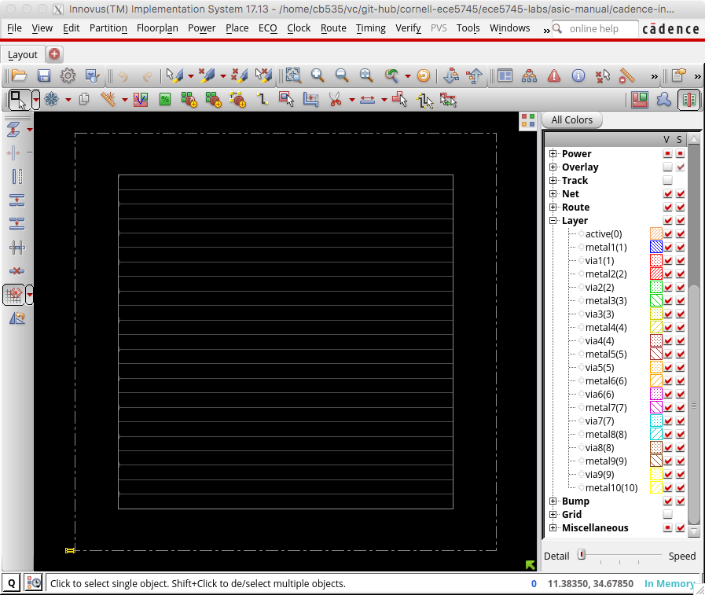

The next step is to work on power routing. Recall that each standard cell
has internal M1 power and ground rails which will connect via abutment
when the cells are placed into rows. If we were just to supply power to
cells using these rails we would likely have large IR drop and the cells
in the middle of the chip would effectively be operating at a much lower
voltage. During power routing, we create a grid of power and ground wires
on the top metal layers and then connect this grid down to the M1 power
rails in each row. We also create a power ring around the entire
floorplan. Before doing the power routing, we need to use the
`globalNetCommand` command to tell Cadence Innovus which nets are power
and which nets are ground (there are _many_ possible names for power and
ground!).

```
 innovus> globalNetConnect VDD -type pgpin -pin VDD -inst * -verbose
 innovus> globalNetConnect VSS -type pgpin -pin VSS -inst * -verbose
```

We can now draw M1 "rails" for the power and ground rails that go along
each row of standard cells.

```
 innovus> sroute -nets {VDD VSS}
```

We now create a power ring around our chip using the `addRing` command. A
power ring ensures we can easily get power and ground to all standard
cells. The command takes parameters specifying the width of each wire in
the ring, the spacing between the two rings, and what metal layers to use
for the ring. We will put the power ring on M6 and M7; we often put the
power routing on the top metal layers since these are fundamentally
global routes and these top layers have low resistance which helps us
minimize static IR drop and di/dt noise. These top layers have high
capacitance but this is not an issue since the power and ground rails are
not switching (and indeed this extra capacitance can serve as a very
modest amount of decoupling capacitance to smooth out time variations in
the power supply).

```
 innovus> addRing -nets {VDD VSS} -width 0.6 -spacing 0.5 \
            -layer [list top 7 bottom 7 left 6 right 6]
```

We have power and ground rails along each row of standard cells and a
power ring, so now we need to hook these up. We can use the `addStripe`
command to draw wires and automatically insert vias whenever wires cross.
First, we draw the vertical "stripes".

```
 innovus> addStripe -nets {VSS VDD} -layer 6 -direction vertical \
            -width 0.4 -spacing 0.5 -set_to_set_distance 5 -start 0.5
```

And then we draw the horizontal "stripes".

```
 innovus> addStripe -nets {VSS VDD} -layer 7 -direction horizontal \
            -width 0.4 -spacing 0.5 -set_to_set_distance 5 -start 0.5
```

The following screen capture illustrates what you should see: a power
ring and grid on M6 and M7 connected to the horizontal power and ground
rails on M1.

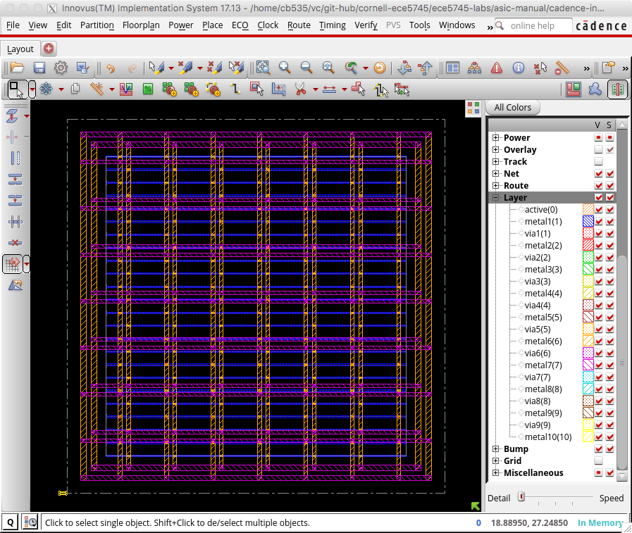

You can toggle the visibility of metal layers by using the panel on the
right. Click the checkbox in the V column to toggle the visibility of the
corresponding layer. You can also simply use the number keys on your
keyboard. Pressing the 6 key will toggle M6 and pressing the 7 key will
toggle M7. Zoom in on a via and toggle the visibility of the metal layers
to see how Cadence Innovus has automatically inserted a via stack that
goes from M1 all the way up to M6 or M7.

Now that we have finished our basic power planning we can do the initial
placement and routing of the standard cells using the `place_design`
command:

```
 innovus> place_design
```

The following screen capture illustrates what you should see: the gates
have been placed underneath a sea of wiring on the various metal layers.

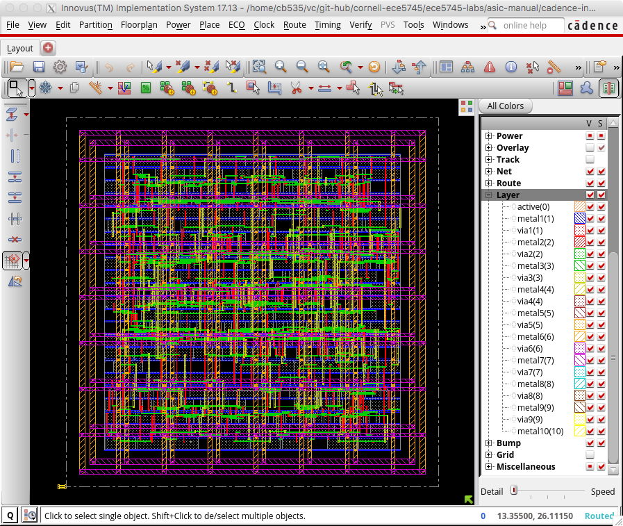

Note that Cadence Innovus has only done a very preliminary routing,
primarily to help improve placement. You can use the Amobea workspace to
help visualize how modules are mapped across the chip. Choose _Windows >
Workspaces > Amoeba_ from the menu. However, we recommend using the
design browser to help visualize how modules are mapped across the chip.
Here are the steps:

 - Choose _Windows > Workspaces > Design Browser + Physical_ from the menu
 - Hide all of the metal layers by pressing the number keys
 - Browse the design hierarchy using the panel on the left
 - Right click on a module, click _Highlight_, select a color

In this way you can view where various modules are located on the chip.
The following screen capture illustrates the location of the five
`MinMaxUnit` modules.

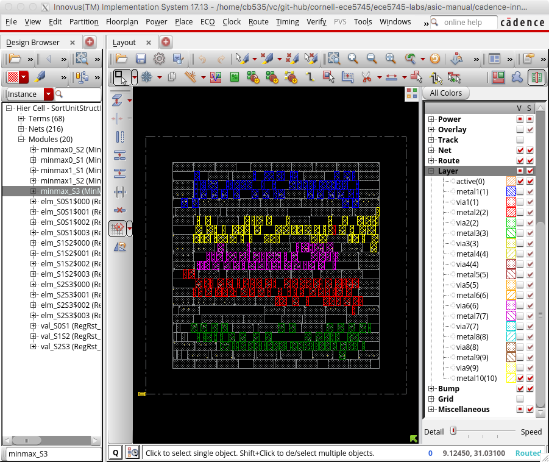

Notice how Cadence Innovus has grouped each module together. The
placement algorithm tries to keep connected standard cells close together
to minimize wiring.

The next step is to improve the quality of the clock tree routing. First,
let's display just the clock tree so we can clearly see the impact of
optimized clock tree routing. In the right panel click on _Net_ and then
deselect the checkbox in the V column next to _Signal_, _Special Net_,
_Power_, and _Ground_ so that only _Clock_ is selected. You should be
able to see the clock snaking around the chip connecting the clock port
of all of the registers. Now use the `ccopt_design` command to optimize
the clock tree routing.

```
 innovus> ccopt_design
```

If you watch closely you should see a significant difference in the
clock tree routing before and after optimization. The following screen
capture illustrates the optimized clock tree routing.

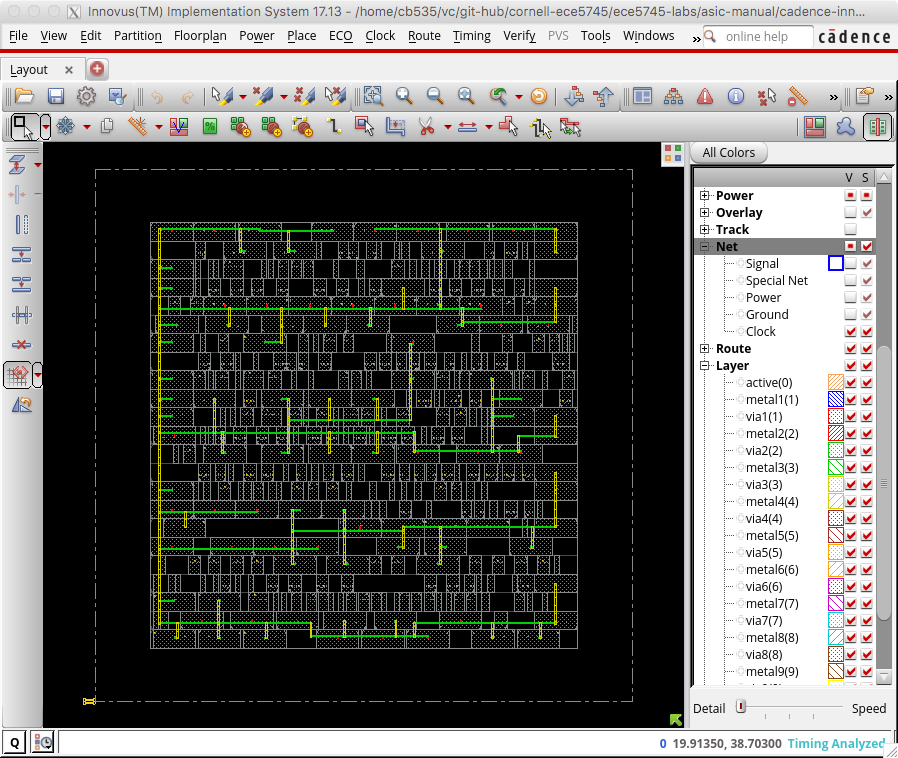

The routes are straighter, shorter, and well balanced. This will result
in much lower clock skew.

The next step is to improve the quality of the signal routing. Display
just the signals but not the power and ground routing by clicking on the
checkbox in the V column next to _Signal_ in the left panel. Then use the
`routeDesign` command to optimize the signal routing.

```
 innovus> routeDesign
```

If you watch closely you should see a significant difference in the
signal routing before and after optimization. The following screen
capture illustrates the optimized signal routing.

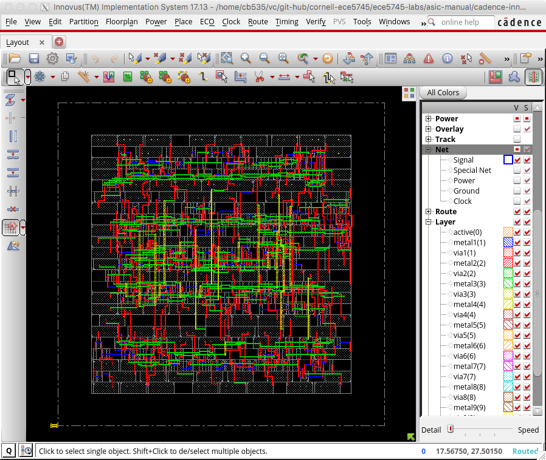

Again the routes are straighter and shorter. This will reduce the
interconnect resistance and capacitance and thus improve the delay and
energy of our design.

The final step is to insert "filler" cells. Filler cells are essentially
empty standard cells whose sole purpose is to connect the wells across
each standard cell row.

```
 innovus> setFillerMode -corePrefix FILL -core "FILLCELL_X4 FILLCELL_X2 FILLCELL_X1"
 innovus> addFiller
```

Zoom in to see some of the detailed routing and take a momment to
appreciate how much effort the tools have done for us automatically to
synthesize, place, and route this design. The following screen capture
shows some of this detailed routing.

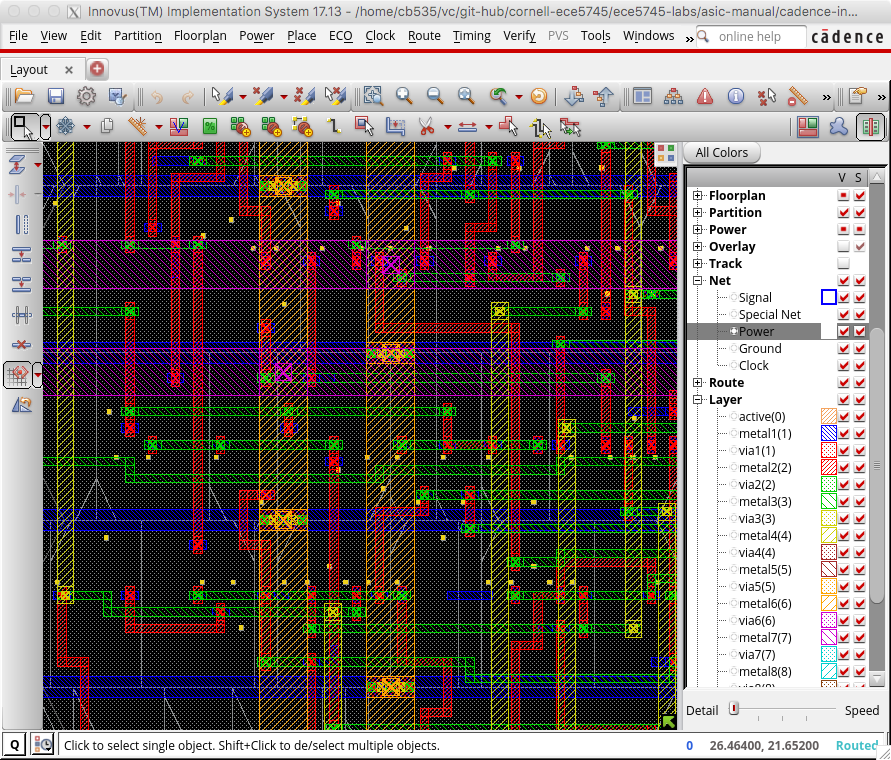

Notice how each metal layer always goes in the same direction. So M2 is
always vertical, M3 is always horizontal, M4 is always vertical, etc.
This helps reduce capacitive coupling across layers and also simplifies
the routing algorithm. Actually, if you look closely in the above screen
shot you can see situations on M2 (red) and M3 (green) where the router
has generated a little "jog" meaning that on a single layer the wire goes
both vertically and horizontally. This is an example of the sophisticated
algorithms used in these tools.

Our design is now on silicon! Obviously there are many more steps
required before you can really tape out a chip. We would need to add an
I/O ring with pads so we can connect the chip to the package, we would
need to do further verification, and additional optimization.

For example, one thing we want to do is verify that the gate-level
netlist matches what is really in the final layout. We can do this using
the `verifyConnectivity` command. We can also do a preliminary "design
rule check" to make sure that the generated metal interconnect does not
violate any design rules with the `verify_drc` command.

```
 innovus> verifyConnectivity
 innovus> verify_drc
```

Now we can generate various output files. We might want to save the final
gate-level netlist for the chip, since Cadence Innovus will often insert
new cells or change cells during its optimization passes.

```
 innovus> saveNetlist post-par.v
```

We can also extract resistance and capacitance for the metal interconnect
and write this to a special `.spef` file. This file can be used for later
timing and/or power analysis.

```
 innovus> extractRC
 innovus> rcOut -rc_corner typical -spef post-par.spef
```

And of course we need to generate the real layout as a `.gds` file. This
is what we will send to the foundry when we are ready to tapeout the
chip.

```
 innovus> streamOut post-par.gds \
            -merge "$env(ECE5745_STDCELLS)/stdcells.gds" \
            -mapFile "$env(ECE5745_STDCELLS)/rtk-stream-out.map"
```

We can also use Cadence Innovus to do timing, area, and power analysis
similar to what we did with Synopsys DC. These post-place-and-route
results will be _much_ more accurate than the preliminary post-synthesis
results. Let's start with a basic timing report.

```
 innovus> report_timing
 ...
 Other End Arrival Time          0.000
 - Setup                         0.045
 + Phase Shift                   0.600
 = Required Time                 0.555
 - Arrival Time                  0.502
 = Slack Time                    0.053
     Clock Rise Edge                 0.000
     + Clock Network Latency (Prop)  0.000
     = Beginpoint Arrival Time       0.000
     +-----------------------------------------------------------------------------------------------+
     |                Instance                |     Arc      |   Cell   | Delay | Arrival | Required |
     |                                        |              |          |       |  Time   |   Time   |
     |----------------------------------------+--------------+----------+-------+---------+----------|
     | elm_S1S2__2/out_reg[3]                 | CK ^         |          |       |   0.000 |    0.053 |
     | elm_S1S2__2/out_reg[3]                 | CK ^ -> Q ^  | DFF_X1   | 0.090 |   0.090 |    0.143 |
     | minmax0_S2/FE_DBTC3_elm_S1S2__2__out_3 | A ^ -> ZN v  | INV_X1   | 0.013 |   0.104 |    0.156 |
     | minmax0_S2/U14                         | A2 v -> ZN v | AND2_X1  | 0.029 |   0.133 |    0.186 |
     | minmax0_S2/U7                          | A2 v -> ZN v | OR2_X1   | 0.048 |   0.181 |    0.234 |
     | minmax0_S2/U10                         | A2 v -> ZN ^ | NOR2_X1  | 0.030 |   0.211 |    0.264 |
     | minmax0_S2/U35                         | A1 ^ -> ZN v | NOR2_X1  | 0.011 |   0.222 |    0.275 |
     | minmax0_S2/U11                         | A1 v -> ZN ^ | NOR2_X1  | 0.025 |   0.247 |    0.300 |
     | minmax0_S2/U38                         | A1 ^ -> ZN v | NOR3_X1  | 0.012 |   0.258 |    0.311 |
     | minmax0_S2/U65                         | A1 v -> ZN ^ | OAI22_X1 | 0.026 |   0.284 |    0.337 |
     | minmax0_S2/U13                         | A1 ^ -> ZN v | NAND2_X1 | 0.077 |   0.362 |    0.415 |
     | minmax0_S2/U33                         | A v -> ZN ^  | INV_X1   | 0.109 |   0.471 |    0.524 |
     | minmax0_S2/U60                         | A2 ^ -> ZN v | OAI22_X1 | 0.032 |   0.502 |    0.555 |
     | elm_S2S3__1/out_reg[7]                 | D v          | DFF_X1   | 0.000 |   0.502 |    0.555 |
     +-----------------------------------------------------------------------------------------------+
```

Note that for these results we used a target clock period of 0.6ns. This
was the shortest clock period which still met timing without any negative
slack during synthesis. From the above report we can see that our design
is still meeting timing even after place-and-route. Note that it is very
likely that the critical path identified by Synsopsys DC after synthesis
will _not_ be the same critical path identified by Cadence Innovus after
place-and-route. This is because Synopsys DC can only guess the final
placement of the cells and interconnect during static timing analysis,
while Cadence Innovus can use the real placement of the cells and
interconnect during static timing analysis. For the same reason, there is
no guarantee that if your design meets timing after synthesis that it
will still meet timing after place-and-route! It is very possible that
your design _will_ meet timing after synthesis and then _will not_ meet
timing after place-and-route. **If your design does not meet timing after
place-and-route you must go back and use a longer target clock period for
synthesis!**

You can use the following steps in Cadence Innovus to display where the
critical path is on the actual chip.

 - Choose _Timing > Debug Timing_ from the menu
 - Right click on first path in the _Path List_
 - Choose _Highlight > Only This Path > Color_

You can also use the Design Browser to highlight specific modules to
visualize how the critical path is routed across the chip between these
modules. The following screen capture illustrates the critical path in
our three-stage sort unit. From the above timing report we know the
critical path basically goes through the `minmax0_S2` module, so we have
highlighted that module in red using the Design Browser. Cadence Innovus
has worked hard in both placement and routing to keep the critical path
short. If your critical path stretches across the entire chip you may
need to take extra steps such as explicit floorplanning or hierarchical
design to help the tools produce a better quality of result.

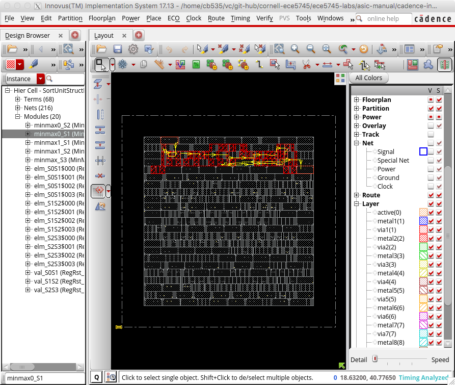

As in Synopsys DC, the `report_area` command can show the area each
module uses and can enable detailed area breakdown analysis. These area
results will be far more accurate than the post-synthesis results.

```
 innovus> report_area
  Depth  Name                          #Inst  Area (um^2)
  --------------------------------------------------------
  0      SortUnitStructRTL_8bit    369    709.688
  1      elm_S1S2__2                   8      36.176
  1      val_S1S2                      3      5.852
  1      minmax0_S1                    58     53.998
  1      elm_S0S1__3                   8      36.176
  1      minmax1_S2                    54     52.934
  1      elm_S0S1__0                   8      36.176
  1      elm_S2S3__0                   8      36.176
  1      elm_S2S3__1                   8      36.176
  1      minmax1_S1                    53     52.934
  1      elm_S1S2__1                   8      36.176
  1      val_S0S1                      3      5.852
  1      elm_S0S1__2                   8      36.176
  1      elm_S2S3__3                   8      36.176
  1      elm_S1S2__3                   8      36.176
  1      val_S2S3                      3      5.852
  1      minmax0_S2                    57     54.264
  1      elm_S1S2__0                   8      36.176
  1      minmax_S3                     42     43.89
  1      elm_S0S1__1                   8      36.176
  1      elm_S2S3__2                   8      36.176
```

The `#Inst` column indicates the number of non-filler cells in that
module. There are a total of 369 standard cells in the design. Each
register has eight standard cells; eight flip-flops since it is an
eight-bit register. The `MinMaxUnit`s have a different number of cells
since they have been optimized differently. The `MinMaxUnit`s consume
about ~40% of the area.

As in Synopsys DC, the `report_power` command can show how much power
each module consumes. Note that this power analysis is still not that
useful yet, since at this stage of the flow the power analysis is still
based purely on statistical activity factor estimation. We will do more
realistic power analysis in the next section.

```
 innovus> report_power -hierarchy all
```

Finally, we go ahead and exit Cadence Innovus.

```
 innovus> exit
```

We can now look at the actual `.gds` file for our design to see the final
layout including all of the cells and the interconnect using the
open-source Klayout GDS viewer. Choose _Display > Full Hierarchy_ from
the menu to display the entire design. Zoom in and out to see the
individual transistors as well as the entire chip.

```
 % cd $TOPDIR/asic-manual/cadence-innovus
 % klayout -l $ECE5745_STDCELLS/klayout.lyp post-par.gds
```

The following screen capture illutrates using Klayout to view the layout
for the entire sort unit.


The following figure shows a zoomed portion of the layout. You can
clearly see the active layer inside the standard cells along with the
signal routing on the lower metal layers. The power routing on the upper
metal layers has been hiddent for clarity.

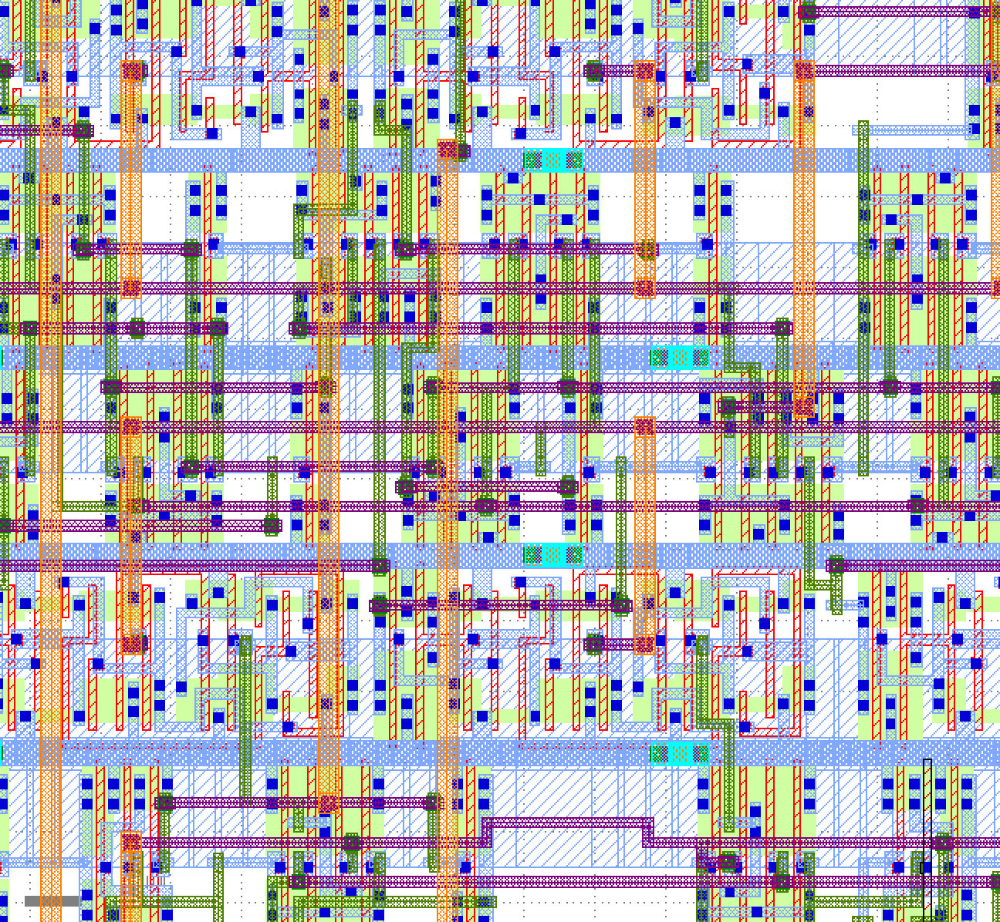

**To Do On Your Own:** Try increasing the bitwidth of the sort unit and see
how this impacts the timing and/or area. For example, experiment with a
sort unit capable of sorting 32-bit or 64-bit values. You will need to
adjust the test harness and simulation driver appropriately.

Try flattening the design during synthesis by using this command:

```
 dc_shell> compile -ungroup_all
```

or try using the `compile_ultra` command with (or without) flattening.
Then push the resulting design through place-and-route to see if this
improves the quality of results with respect to timing and/or area.

```
 dc_shell> compile_ultra -no_autoungroup
```

You can put a sequence of commands in a `.tcl` file and then run Cadence
Innovus using those commands in one step like this:

```
 % cd $TOPDIR/asic-manual/cadence-innovus
 % innovus -64 -no_gui -files init.tcl
```

The `-no_gui` command prevents Cadence Innovus from opening the GUI which
can make interacting with the tool much faster. So consider placing the
commands from this section into a `.tcl` file to make it easy to rerun
Cadence Innovus.

Using Synopsys PrimeTime for Power Analysis
--------------------------------------------------------------------------

Synopsys PrimeTime (PT) is primarily used for very accurate "sign-off"
static timing analysis (more accurate than the analysis performed by
Synopsys DC and Cadence Innovus), but in this course, we will only use
Synopsys PT for power analysis. There are many ways to perform power
analysis. As mentioned earlier, the post-synthesis and
post-place-and-route power reports use statistical power analysis where
we simply assume some toggle probability on each net. For more accurate
power analysis we need to find out the actual activity for every net for
a given experiment. One way to do this is to perform post-place-and-route
gate-level simulation. In other words, we can run a benchmark executing
on the gate-level netlist generated after place-and-route. These kind of
gate-level simulations can be very, very slow and are tedious to setup
correctly.

In this course, we will use a simpler approach that is slightly less
accurate than gate-level simulation. We will use the per-net activity
factors from the RTL simulation which were stored in an `.saif` file
earlier in this tutorial. The challenge is that the activity factors in
the `.saif` file are from RTL simulation, and the RTL model is obviously
not a one-to-one match with the gate-level model. The RTL model might
have had a net called `result_plus_4`, but the logic may have been
optimized during synthesis and place-and-route such that this net is
simply not in the gate-level model. Similarly, the gate-level model will
have many nets which do not map to corresponding nets in the RTL model.
Fortunately, there will be many nets that _do_ match between the RTL and
gate-level models. For example, if we have a register in our RTL model
then that register is guaranteed to be in the gate-level model. So if we
know the activity factor of each bit in the register from the `.saif`
file, then we know the activity factor or each corresponding flip-flop in
the gate-level model. Similarly, if we have a module port in our RTL
model and we have not flattened the design, then that module port is
guaranteed to be in the gate-level model (another good reason not to
flatten your design!). Synopsys PT can use sophisticated algorithms
including many tiny little gate-level simulations of just a few gates in
order to estimate the activity factor of all nets downstream from the
valid activity factors included in the `.saif`. For more information
about this kind of power analysis, consult Chapter 5 (more specifically,
the section titled "Estimating Non-Annotated Switching Activity" of the
[PrimeTime PX User
Guide](http://www.csl.cornell.edu/courses/ece5745/syndocs/ptpx.pdf).

We start by creating a subdirectory for our work, and then launching
Synopsys PT.

```
 % mkdir -p $TOPDIR/asic-manual/synopsys-pt
 % cd $TOPDIR/asic-manual/synopsys-pt
 % pt_shell
```

To make it easier to copy-and-paste commands from this document, we tell
Synopsys PT to ignore the prefix `pt_shell>` using the following:

```
 pt_shell> alias "pt_shell>" ""
```

We begin by setting the `target_library` and `link_library` variables as
before.

```
 pt_shell> set_app_var target_library "$env(ECE5745_STDCELLS)/stdcells.db"
 pt_shell> set_app_var link_library   "* $env(ECE5745_STDCELLS)/stdcells.db"
```

Since Synopsys PT is primarily used for static timing analysis, we need
to explicitly tell Synopsys PT that we want to use it for power analysis.

```
 pt_shell> set_app_var power_enable_analysis true
```

We now read in the gate-level netlist, tell Synopsys PT we want to do
power analysis for the top-level module, and link the design (i.e.,
recursively resolve all of the module references starting from the
top-level module).

```
 pt_shell> read_verilog   "../cadence-innovus/post-par.v"
 pt_shell> current_design SortUnitStructRTL_8bit
 pt_shell> link_design
```

In order to do power analysis, Synopsys PT needs to know the clock
period. Here we will set the clock frequency to be the same as the
initial clock constraint, but note that this is only valid if our design
actually met timing. If our design has negative slack, then this means we
cannot actually run the design at the target clock frequency and we will
need to iterate to meet timing.

```
 pt_shell> create_clock clk -name ideal_clock1 -period 0.6
```

The key to making this approach to power analysis work, is to ensure as
many nets as possible match between the `.saif` generated from RTL and
the gate-level netlist. Synopsys DC will change the names of various nets
as it does synthesis, so if you recall we used some extra commands in
Synopsys DC to generate a `.namemap` file. This name mapping file maps
high-level RTL names to low-level gate-level names and will result in a
better match between these two models. So the next step is to read in
this previously generated `.namemap` file.

```
 pt_shell> source ../synopsys-dc/post-synth.namemap
```

We are now ready to read in the actual activity factors which will be
used for power analysis. The `.saif` file comes from a `.vcd` file which
in turn came from running a simulation with a test harness. We need to
strip off part of the instance names in the `.saif` file since the
gate-level netlist does not have this test harness. Again, the key is to
make sure we do everything we can to ensure as many nets as possible
match between the `.saif` generated from RTL and the gate-level netlist.

```
 pt_shell> read_saif "../../sim/build/sort-rtl-struct-random.saif" -strip_path "TOP/SortUnitStructRTL_8bit"
```

The `.db` file includes parasitic capacitance estimates for every pin of
every standard cell, but to improve the accuracy of power analysis, we
also need to include parasitic capacitances from the interconnect. Recall
that we used Cadence Innovus to generate exactly this information in a
`.spef` file. So we now read in these additional parasitic capacitance
values for every net in the gate-level netlist.

```
 pt_shell> read_parasitics -format spef "../cadence-innovus/post-par.spef"
```

We now have everything we need to perform the power analysis: (1) the
activity factor of a subset set of the nets, (2) the capacitance of every
net/port, (3) the supply voltage, and (4) the clock frequency. We use the
`update_power` command to propagate activity factors to unannotated nest
and to estimate the power of our design.

```
 pt_shell> update_power
```

We can use the `report_power` command to show a high-level overview of
how much power the sort unit consumes.

```
 pt_shell> report_power -nosplit
 ...
                Internal Switching Leakage Total
 Power Group    Power    Power     Power   Power   (     %)
 ----------------------------------------------------------
 clock_network  3.8e-04  0.0       0.0     3.8e-04 (25.76%)
 register       4.1e-04  8.2e-05   7.8e-06 5.0e-04 (34.06%)
 combinational  2.4e-04  3.4e-04   6.6e-06 5.9e-04 (40.18%)
 sequential     0.0      0.0       0.0     0.0     ( 0.00%)
 memory         0.0      0.0       0.0     0.0     ( 0.00%)
 io_pad         0.0      0.0       0.0     0.0     ( 0.00%)
 black_box      0.0      0.0       0.0     0.0     ( 0.00%)

  Net Switching Power  = 4.267e-04   (28.82%)
  Cell Internal Power  = 1.039e-03   (70.20%)
  Cell Leakage Power   = 1.450e-05   ( 0.98%)
                         ---------
  Total Power          = 1.481e-03  (100.00%)
```

These numbers are in Watts. We can see that the sort unit consumes ~1.5mW
of power when processing random input data. Power is the rate change of
energy (i.e., energy divided by execution time), so the total energy is
just the product of the total power, the number of cycles, and the cycle
time. When we ran the sort unit simulator at the beginning of the
tutorial, we saw that the simulation required 105 cycles. Assuming our
sort unit runs as 0.6ns, this means the total energy is 1.5mW * 105 *
0.6ns = 95pJ. Since we are doing 100 sorts, this corresponds to about 1pJ
per sort.

The power is broken down into internal, switching, and leakage power.
Internal and switching power are both forms of dynamic power, while
leakage power is a form of static power. Notice that in this case, the
dynamic power is much more significant than the static power. Internal
power was described earlier in this tutorial, so you may want to revisit
that section. Note that internal power includes short circuit power, but
it can also include the local clock power internal to the cell. In this
overview, the power is also broken down by the power consumed in the
global clock network, registers, and combinational logic. Switching power
is the power dissipated by the charging and discharging of the load
capacitance at the output of each cell. Leakage power is the constant
power due to subthreshold leakage. Sometimes we might want to factor out
the static leakage power and focus more on the dynamic energy since
including leakage power would mix energy and performance (i.e., using
more cycles requires more leakage power even if we are not doing any more
work during those cycles).

Although the above breakdown is somewhat useful, it is even more useful
to use the `report_power` command to show how much power each module
consumes in the design.

```
 pt_shell> report_power -nosplit -hierarchy
 ...
                             Int      Switch   Leak     Total
 Hierarchy                   Power    Power    Power    Power        %
 ---------------------------------------------------------------------
 SortUnitStructRTL_8bit  1.04e-03 4.27e-04 1.45e-05 1.48e-03 100.0
  elm_S2S3__0 (Reg_4)        6.17e-05 5.74e-07 6.30e-07 6.29e-05   4.3
  elm_S1S2__0 (Reg_8)        6.34e-05 6.60e-06 6.33e-07 7.06e-05   4.8
  elm_S2S3__1 (Reg_3)        6.50e-05 7.91e-06 6.33e-07 7.36e-05   5.0
  val_S0S1    (RegRst_0)     6.66e-06 6.89e-08 1.17e-07 6.85e-06   0.5
  elm_S1S2__1 (Reg_7)        6.56e-05 8.73e-06 6.32e-07 7.50e-05   5.1
  elm_S0S1__0 (Reg_0)        6.49e-05 6.99e-06 6.33e-07 7.26e-05   4.9
  elm_S2S3__2 (Reg_2)        6.46e-05 9.64e-06 6.33e-07 7.49e-05   5.1
  elm_S0S1__1 (Reg_11)       6.52e-05 8.31e-06 6.33e-07 7.42e-05   5.0
  minmax0_S1  (MinMaxUnit_0) 5.18e-05 7.10e-05 1.36e-06 1.24e-04   8.4
  elm_S2S3__3 (Reg_1)        6.42e-05 6.38e-07 6.32e-07 6.55e-05   4.4
  elm_S1S2__2 (Reg_6)        6.41e-05 9.20e-06 6.33e-07 7.39e-05   5.0
  elm_S0S1__2 (Reg_10)       6.57e-05 7.03e-06 6.33e-07 7.34e-05   5.0
  minmax0_S2  (MinMaxUnit_4) 4.93e-05 6.81e-05 1.39e-06 1.19e-04   8.0
  elm_S1S2__3 (Reg_5)        6.44e-05 8.12e-06 6.32e-07 7.31e-05   4.9
  elm_S0S1__3 (Reg_9)        6.61e-05 9.15e-06 6.33e-07 7.59e-05   5.1
  minmax1_S1  (MinMaxUnit_3) 5.20e-05 7.23e-05 1.36e-06 1.26e-04   8.5
  minmax1_S2  (MinMaxUnit_2) 4.91e-05 7.01e-05 1.33e-06 1.20e-04   8.1
  minmax_S3   (MinMaxUnit_1) 4.23e-05 6.21e-05 1.13e-06 1.06e-04   7.1
  val_S2S3    (RegRst_1)     6.65e-06 5.00e-08 1.17e-07 6.82e-06   0.5
  val_S1S2    (RegRst_2)     6.67e-06 6.84e-08 1.17e-07 6.85e-06   0.5
```

From this breakdown, you can see that each `MinMaxUnit` consumes about
twice as much power as each register.

Finally, we go ahead and exit Synopsys PT.

```
 pt_shell> exit
```

**To Do On Your Own:** You can experiment with the power consumed when
executing a different dataset by simply reruning the simulation to
generate a new `.vcd` file, converting that file to an `.saif` file, and
then following the above steps again. Use the following commands to
generate an `.saif` file for a simulation where all of the input values
to the sort unit are zeros.

```
 % cd $TOPDIR/sim/build
 % ../tut3_pymtl/sort/sort-sim --impl rtl-struct --input zeros --stats --translate --dump-vcd
 num_cycles          = 105
 num_cycles_per_sort = 1.05
 % vcd2saif -input sort-rtl-struct-zeros.vcd -output sort-rtl-struct-zeros.saif
```

Do you think a stream of random data will consume more or less power
compared to a stream of zeros? Rerun Synopsys PT to find out. This means
you will need to read in the new `.saif` file. In other words, use the
following command:

```
 pt_shell> read_saif "../../sim/build/sort-rtl-struct-zeros.saif" -strip_path "TOP/SortUnitStructRTL_8bit"
```

As with Synopsys DC, you can put a sequence of commands in a `.tcl` file
and then run Synopsys PT using those commands in one step like this:

```
 % cd $TOPDIR/asic-manual/synopsys-pt
 % pt_shell -file init.tcl
```

So consider placing the commands from this section into a `.tcl` file to
make it easy to rerun Synopsys PT.

Using Verilog RTL Models
--------------------------------------------------------------------------

Students are welcome to use Verilog instead of PyMTL3 to design their RTL
models. Having said this, we will still exclusively use PyMTL3 for all
test harnesses, FL/CL models, and simulation drivers. This really
simplifies managing the course, and PyMTL3 is actually a very productive
way to test/evaluate your Verilog RTL designs. We use PyMTL3's Verilog
import feature described in the Verilog tutorial to make all of this
work. The following commands will run all of the tests on the _Verilog_
implementation of the sort unit.

```
 % cd $TOPDIR/sim/build
 % rm -rf *
 % py.test ../tut4_verilog/sort
```

As before, the tests for the `SortUnitStructRTL` will fail. You can just
copy over your implementation of the `MinMaxUnit` from when you completed
the Verilog tutorial. If you have not completed the PyMTL3 tutorial then
you might want to go back and do that now. Basically the `MinMaxUnit`
should look like this:

```
`ifndef TUT4_VERILOG_SORT_MIN_MAX_UNIT_V
`define TUT4_VERILOG_SORT_MIN_MAX_UNIT_V

module tut4_verilog_sort_MinMaxUnit
#(
  parameter p_nbits = 1
)(
  input  logic [p_nbits-1:0] in0,
  input  logic [p_nbits-1:0] in1,
  output logic [p_nbits-1:0] out_min,
  output logic [p_nbits-1:0] out_max
);

  always_comb begin

    // Find min/max

    if ( in0 >= in1 ) begin
      out_max = in0;
      out_min = in1;
    end
    else if ( in0 < in1 ) begin
      out_max = in1;
      out_min = in0;
    end

    // Handle case where there is an X in the input

    else begin
      out_min = 'x;
      out_max = 'x;
    end

  end

endmodule

`endif /* TUT4_VERILOG_SORT_MIN_MAX_UNIT_V */
```

After running the tests we use the sort unit simulator to translate the
PyMTL3 RTL model into Verilog and to dump the VCD file that we want to use
for power analysis.

```
 % cd $TOPDIR/sim/build
 % ../tut4_verilog/sort/sort-sim --impl rtl-struct --stats --translate --dump-vcd
 % vcd2saif -input sort-rtl-struct-random.vcd -output sort-rtl-struct-random.saif
```

Take a moment to open up the translated Verilog which should be in a file
named `SortUnitStructRTL_8bit.v`. You might ask, "Why do we need to use
PyMTL3 to translate the Verilog if we already have the Verilog?" PyMTL3
will take care of preprocessing all of your Verilog RTL code to ensure it
is in a single Verilog file. This greatly simplifies getting your design
into the ASIC flow. This also ensures a one-to-one match between the
Verilog that was used to generate the VCD file and the Verilog that is
used in the ASIC flow.

Once you have tested your design and generated the single Verilog file
and the VCD file, you can push the design through the ASIC flow using the
exact same steps we used above.

To Do On Your Own
--------------------------------------------------------------------------

Use what you have learned so far to push the GCD Unit through the flow.
You can use either the PyMTL3 or Verilog GCD Unit provided along with
this tutorial. You will need to verify the GCD Unit works, generate the
corresponding Verilog RTL and VCD file using the GCD Unit simulator,
generate the corresponding `.saif` file, use Synopsys DC to synthesize
the design to a gate-level netlist, use Cadence Innovus to
place-and-route the design, and use Synopsys PT for power analysis.

